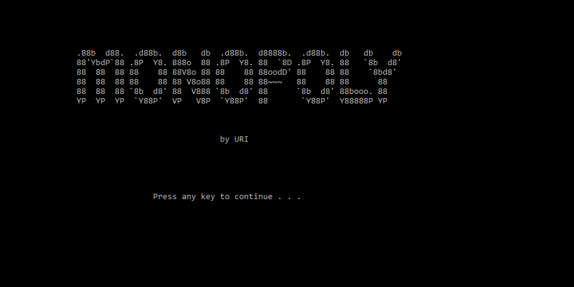
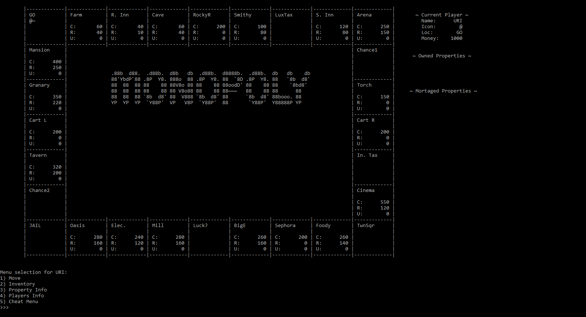

# Monopoly_Cpp

 
A CLI version of Monopoly. This program follows the OO design. Implementations for AI, trading, and auction were missing due to time constraints. Features such as: buying properties, moving across the board, jail, income + luxury tax, bankcruptcy, mortgaging, cards, house upgrades, *normal* multiplayer (support up to six players), railroad travel, same-space player battle, and cheats (for testing purposes) were added due for project submission.

## Disclaimer

This program was made as a final project for Prog. Fundamentals II course. Posting the enterity of the project as a repository is now for academic/collection/testing purposes. **Use at your own discretion.** (Copy-pasting is a violation to academic integrity.)